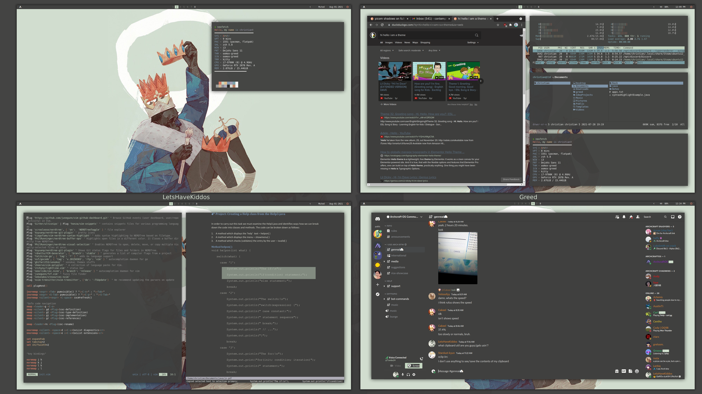
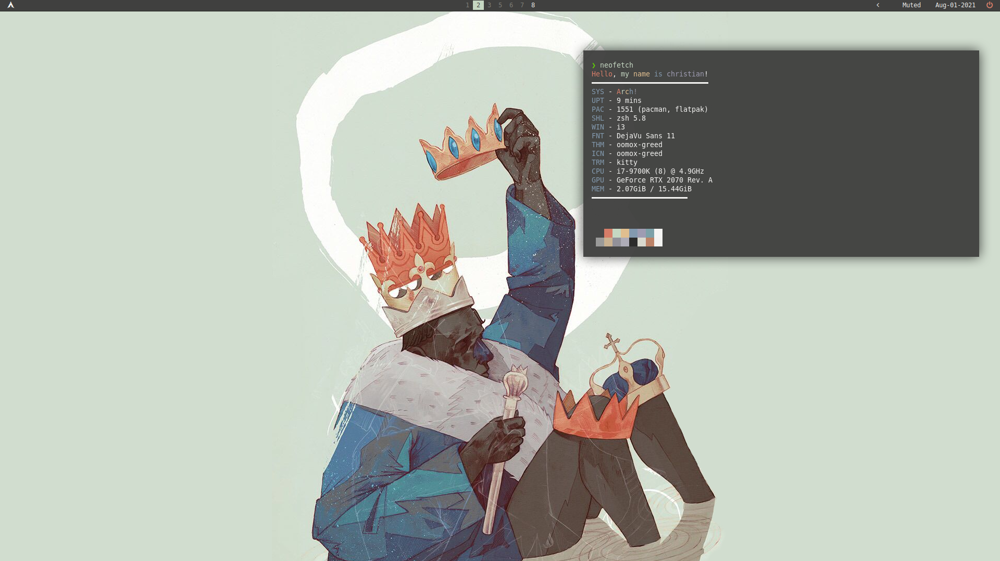
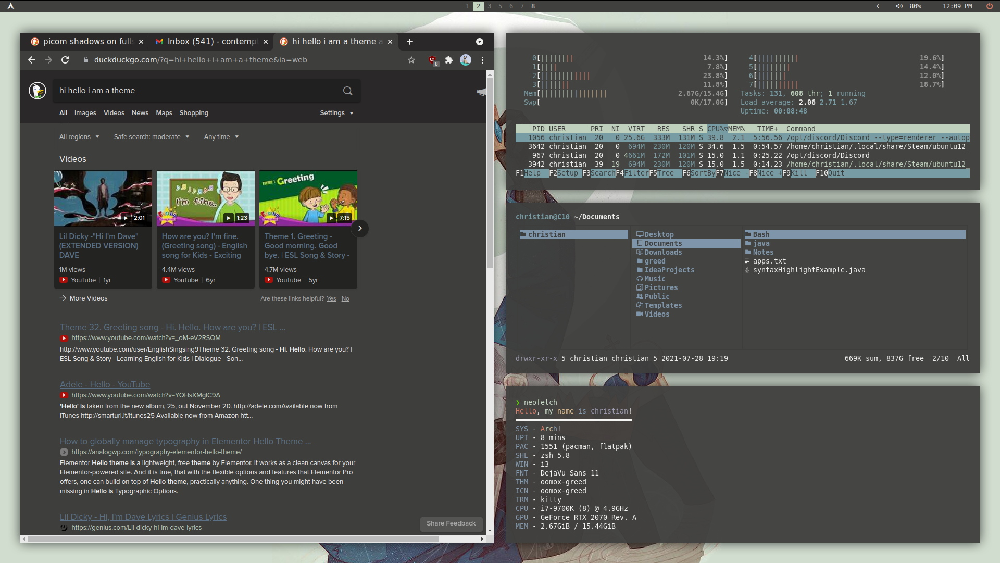
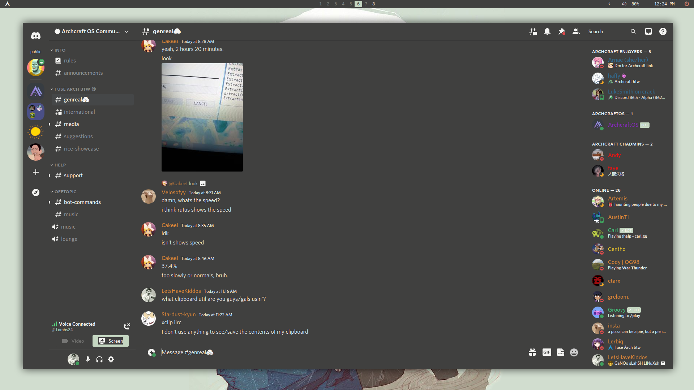
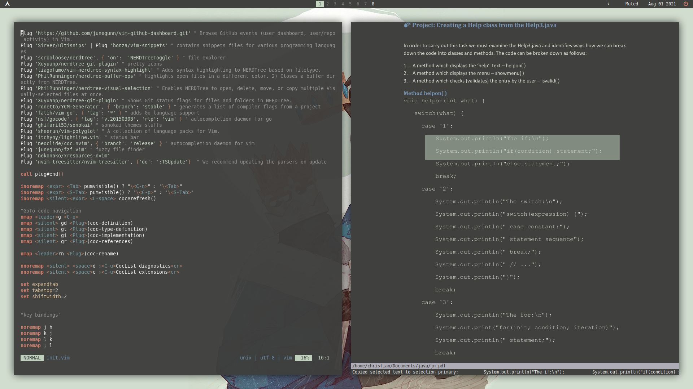
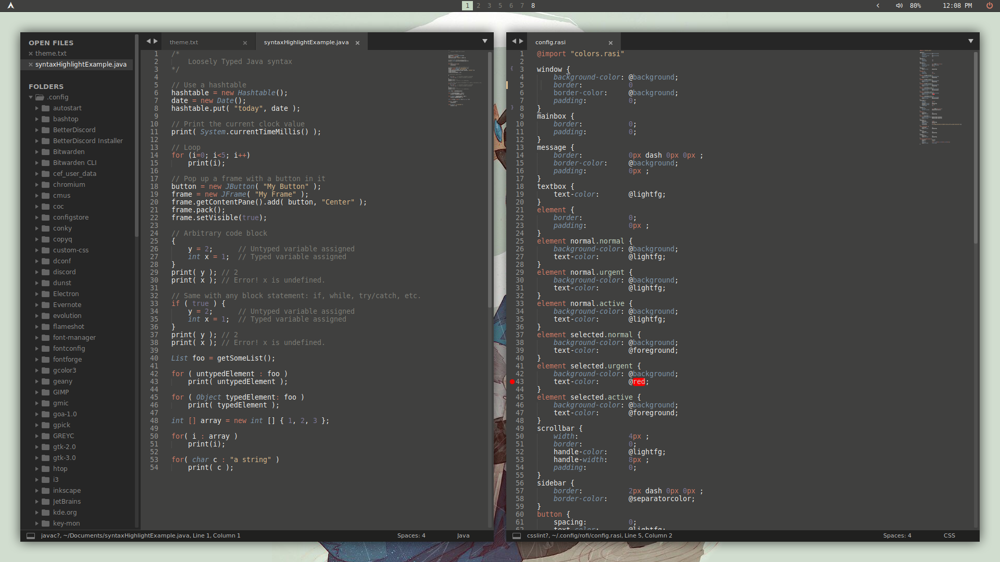
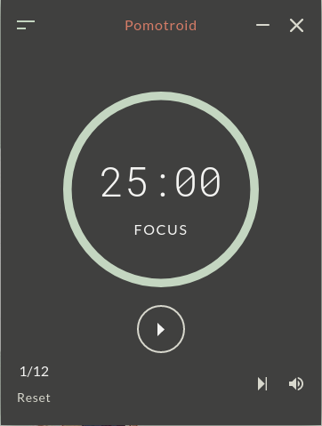
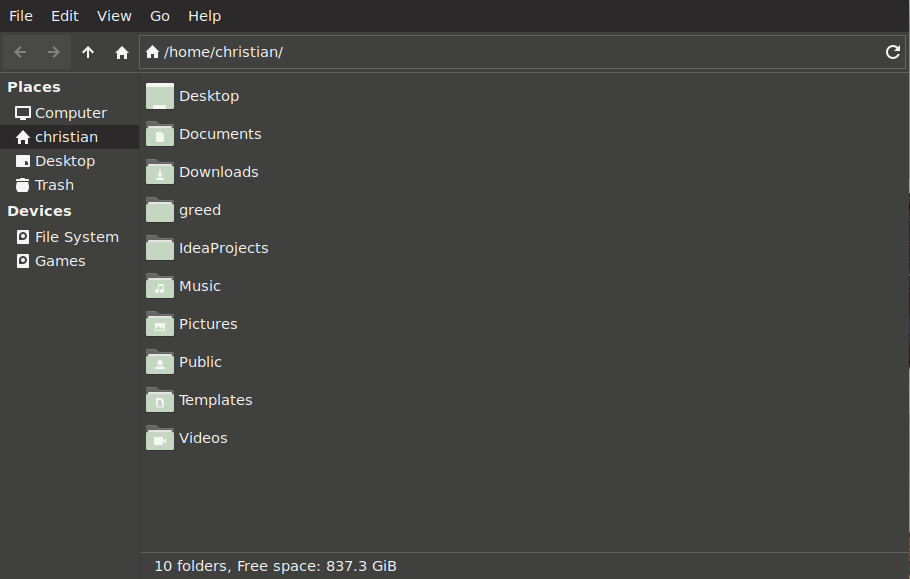

Greed
===========================

A color scheme made to fit my theme "Greed" inspired by Patryk Hardziej's "Greed."

Background Source: https://hardziej.com/projects/greed/

## Tools used
i3-gaps, i3lock-fancy or i3lock-color & betterlockscreen, rofi, dunst, kitty, sublime, neovim, polybar, thunar, zathura.

I provide GTK and QT options.

No extra changes for GTK needed, for QT I recommend plastique. If youre on arch [aur/qt5-styleplugins-git]

## Boot
I provided a grub theme (mostly just colors but hey its consistent with the theme)

If you're not comfortable changing this I wouldn't even bother. It's a bit of a hassle.

## Notes
I recommend going through and changing the "monitor: DP-2" or any variation of this and using "xrandr" to change to your monitor(s).
I'm super OCD and like my rofi/dunst/polybar to spawn only on one of my monitors. I'm not sure everything you should look at but rofi/polybar/i3 are for sure you should look in the configs.

edit: I recently switched to alsa instead of pulse. I have fancy-shmancy audio interface. 

## Screenshots: 

